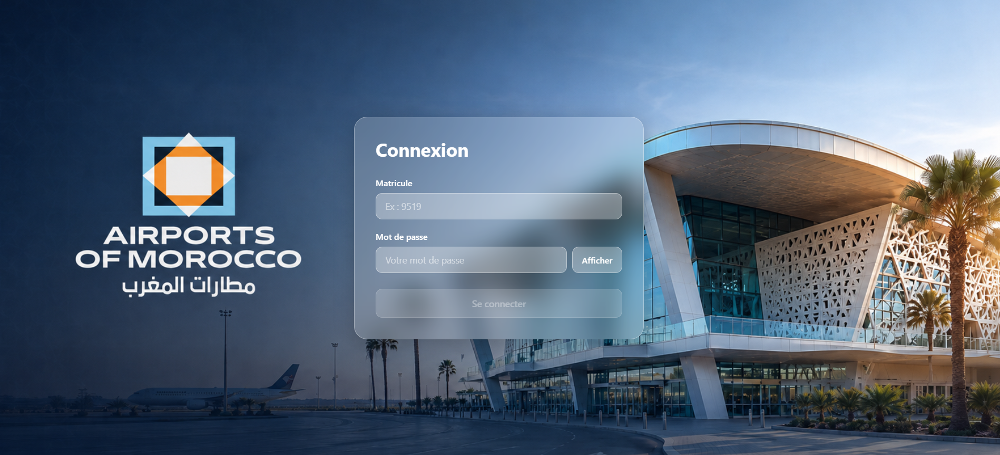
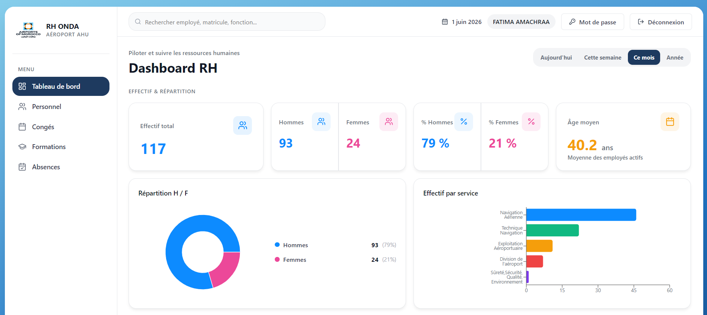
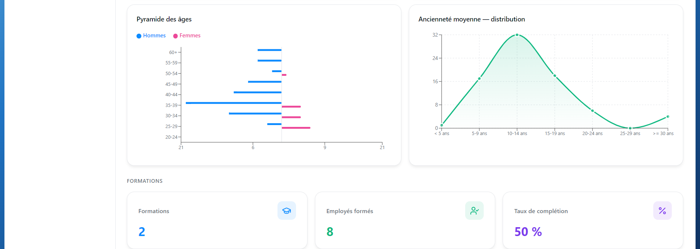
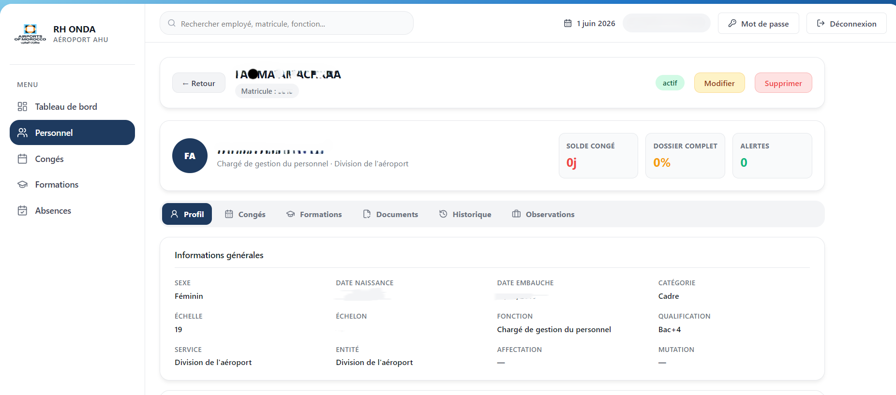
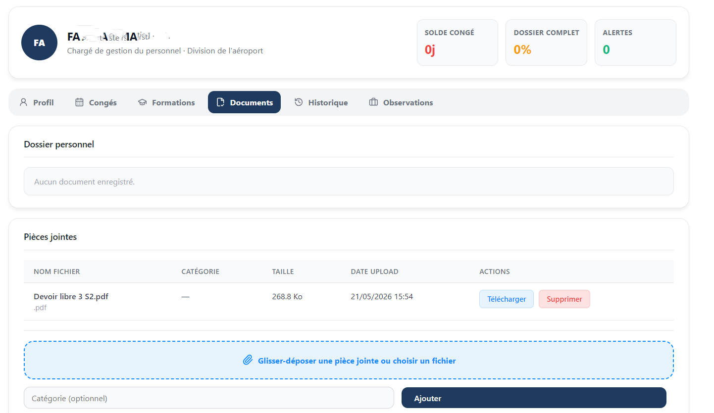
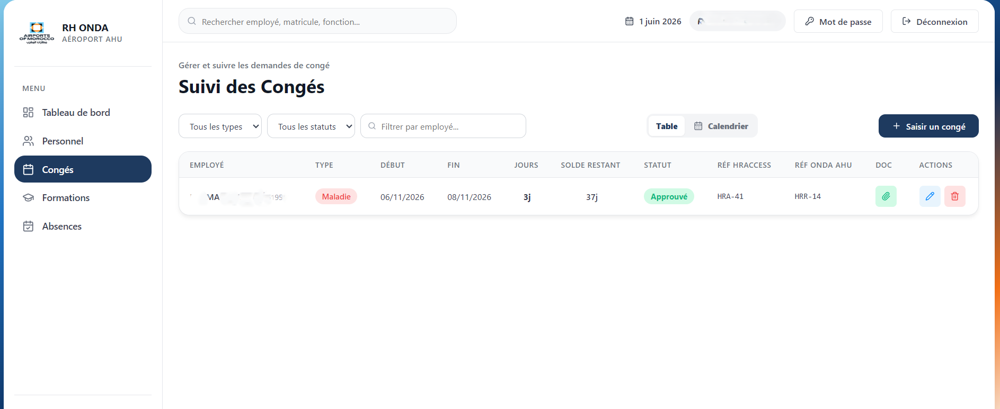
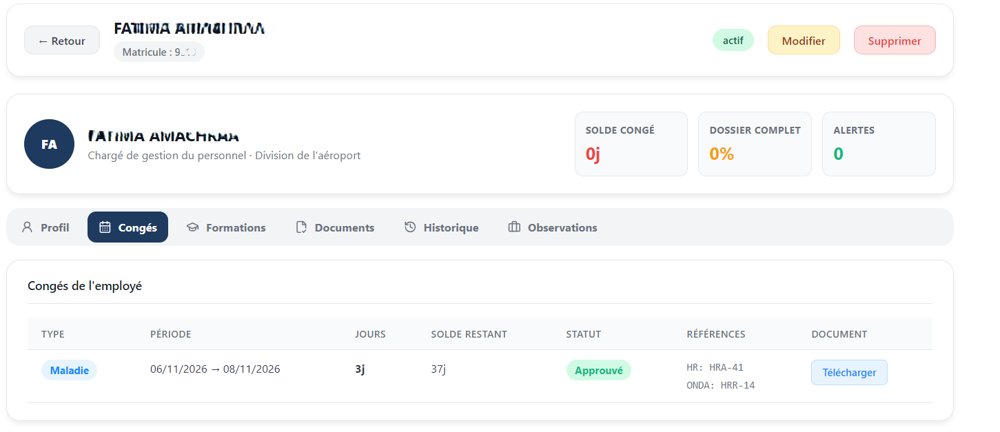
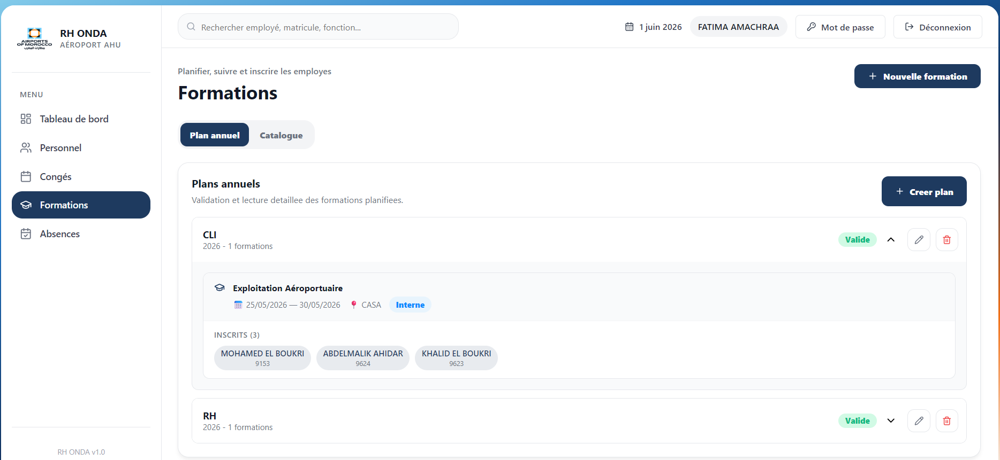

# RH ONDA — Système de Gestion des Ressources Humaines
### Aéroport Al Hoceima (AHU) · Airports of Morocco

Application web complète de gestion RH développée pour l'aéroport Al Hoceima dans le cadre d'un projet de fin d'études (PFE). Elle couvre la gestion du personnel, des congés, des formations et offre un tableau de bord analytique en temps réel.

---

## Aperçu de l'application

### Connexion
> Page d'authentification avec effet glassmorphisme sur fond de l'aéroport



---

### Tableau de bord RH
> KPI en temps réel : effectif actif, répartition H/F, âge moyen, graphiques par service



---

### Statistiques & Analyses
> Pyramide des âges, distribution de l'ancienneté, taux de complétion des formations



---

### Fiche Employé — Profil
> Détail complet : informations générales, solde congé, dossier, alertes — 6 onglets



---

### Fiche Employé — Documents
> Pièces jointes : upload par glisser-déposer, téléchargement, suppression



---

### Suivi des Congés
> Tableau de suivi avec filtres, références HRAccess & ONDA, actions rapides



---

### Congés dans la Fiche Employé
> Historique des congés de l'employé avec statut, durée et solde restant



---

### Gestion des Formations
> Plans annuels, catalogue, inscriptions par service, évaluations



---

## Stack technique

| Couche | Technologie |
|---|---|
| Frontend | React 19, Vite, Recharts, Lucide Icons |
| Backend | Laravel 13, PHP 8.3, Sanctum (token Bearer) |
| Base de données | MySQL 8.0 (prod) / SQLite (dev) |
| Infrastructure | Docker Compose, Nginx |
| Synchronisation | Macros VBA Excel → MySQL via ODBC |

---

## Architecture

```
Rh_onda_ahu/
├── backend/                   ← API REST Laravel
│   ├── app/Http/Controllers/  ← 10 contrôleurs
│   ├── app/Models/            ← 13 modèles Eloquent
│   ├── database/migrations/   ← 17 migrations
│   └── routes/api.php         ← 44 routes
├── frontend/                  ← SPA React
│   └── src/components/        ← 15+ composants
├── nginx/                     ← Reverse proxy
├── vba/                       ← Sync Excel
└── docker-compose.yml
```

---

## Lancer le projet

### Avec Docker (recommandé)

```bash
git clone https://github.com/ton-repo/rh-onda-ahu.git
cd rh-onda-ahu
docker compose up --build
```

L'application est accessible sur [http://localhost](http://localhost)

### En développement local

```bash
# Backend
cd backend
composer install
cp .env.example .env
php artisan key:generate
php artisan migrate
php artisan serve

# Frontend (dans un autre terminal)
cd frontend
npm install
npm run dev
```

---

## Fonctionnalités

- **Authentification** sécurisée par token Sanctum avec 3 niveaux de rôle (RH, DG, Employé)
- **Dashboard analytique** : KPI effectif, répartition H/F, pyramide des âges, ancienneté
- **Gestion du personnel** : CRUD complet, import Excel, recherche globale
- **Fiche employé** : 6 onglets (Profil, Congés, Formations, Documents, Historique, Observations)
- **Congés** : suivi des demandes avec références HRAccess et ONDA, pièces jointes
- **Formations** : plans annuels, catalogue de cours, inscriptions, évaluations
- **Synchronisation VBA** : export/import bidirectionnel depuis Excel

---

## Auteur

**Anass El Ghalbzouri** — Projet de Fin d'Études  
Aéroport Al Hoceima · Airports of Morocco · 2026
